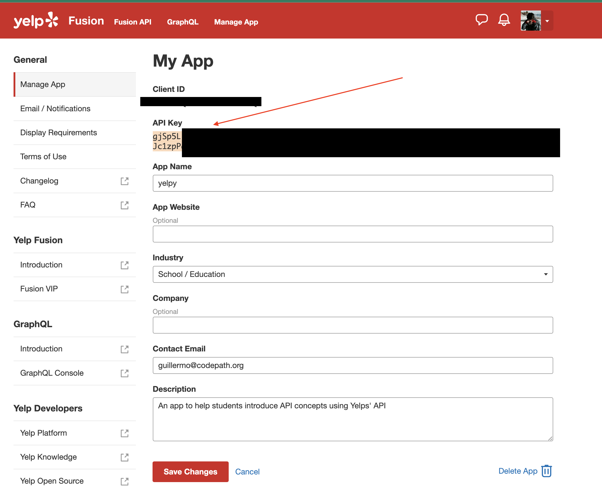
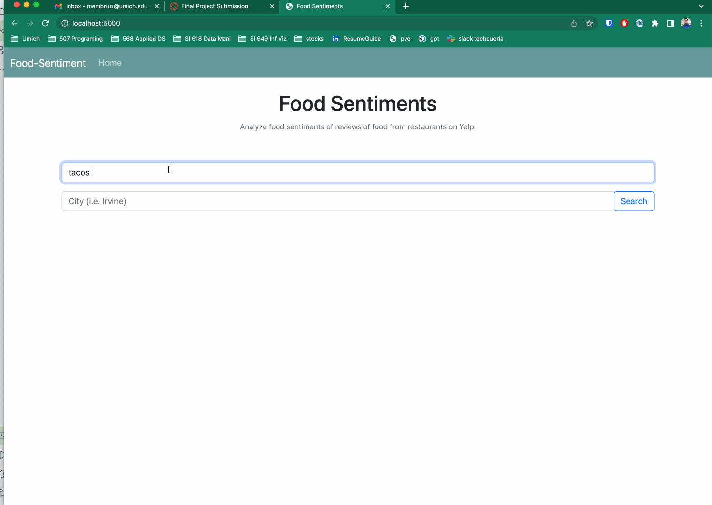
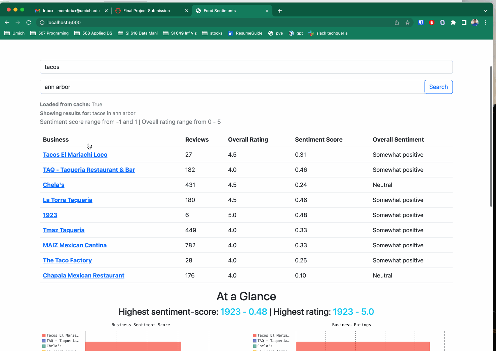
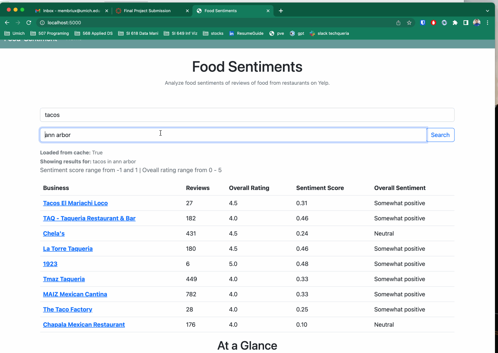

# Final Project Checkpoint
### Project Name: Food Sentiment
- Name: Guillermo Sanchez Lamas
- Uniqid: membriux

### GitHub Link - https://github.com/membriux/si-507-final-project

Web app that tells you what people are feeling about certain food items from the YelpAPI.

While reading reviews from the business, you might notice that the ratings don't match with the sentiment analysis. That's because a rating number tells one side of the story, but the sentiments of users tell another.

## How it works

Type inputs for the food item and location you want to search and the app will return a table showing the information about each business (specially the sentiment analysis). User can click on the name of the business, and it will take them to a page showing the analyzed reviews with the sentiment score of each.

## Built With

* [Yelp Fusion API](https://www.yelp.com/developers/documentation/v3) - Used to collect data
* [Flask](http://flask.pocoo.org/) - Web development framework for Python
* [Pygal](https://www.pygal.org/en/stable/) - "Sexy" Python Charting
* [TextBlob](https://textblob.readthedocs.io/en/dev/) - Text processing/Sentiment Analysis

## Setup

1. Obtain your Yelp Fusion API key at the [dashboard](https://www.yelp.com/developers/v3/manage_app).
    -  
1. Create a file called `.env` and add your API key as the following:
    - `API_KEY=your_api_key`
1. Install python packages using the following command:
   - `pip install -r requirements.txt`

Now, run `python app.py`

## Data Sources

### 1. Yelp Fusion API
- Documentation -> https://www.yelp.com/developers/documentation/v3
- Endpoint 1: Search Businesses -> https://api.yelp.com/v3/businesses/search
- Endpoint 2: Reviews of Business -> https://docs.developer.yelp.com/reference/v3_business_reviews
- Format: JSON
- Access Method: API Key. Cached locally by me
- Summary of Business data object:
    - Records available: 1000 per request
    - Record retrived: 9 per request
    - Description: 
        - id (str) - Yelp Encrypted Business ID.
        - name (str) - name of business
        - review_count (str) - num of reviews for business
        - rating (str) - ratin for business (1 - 5)
- Summary of Reviews data object:
    - Records available: 3 per business
    - Records retrieved: 3 per business
    - Description:
        - text (str) - content of review
        - rating (float) - content 
        - user (objcet) - user who created review
- Cache evidence
    - cache snapshot
        
    - Cache demo
        

## Data Structure

The way in which we are representing the "tree" in this case is through a details page. When the user clicks on one of the businesses from the results table, they will be taken to a details page showing the reviews for that business.
Using the details page is our way of representing the tree structure. Please view walkthrough #2 to view check out how the details page looks and how it represents the tree view. 

## Interaction and Presentation Plans

This is a Python application that uses the Flask web framework to create a web application. The application gathers data from the Yelp API based on the user's search term and location. The application analyzes the businesses retrieved and displays their ratings and reviews in a graphical format. The user can search for businesses by entering a term and location. The application also allows the user to view more detailed information about a specific business by clicking on it.

The application will display a table and charts that allows the user to visualize the data from their search results. Additionally, the application has a caching mechanism that stores data retrieved from previous searches to improve performance.

## Walkthroughs

Walkthroughs can be found in repo github with text descriptions:

1. User can search for food item and location and get a response back with results
   - 
1. User can click on a business and it will take them to a details page with three reviews from that business
   - 
1. User can view charts regarding the stars vs sentiment scores and interact with them
   - 
1. User can load from cache after loading first time
   - 

